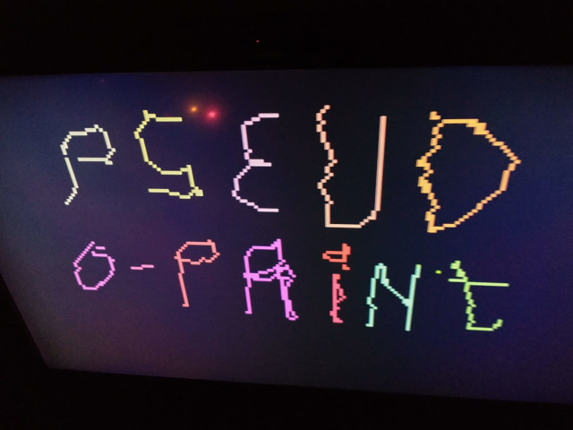
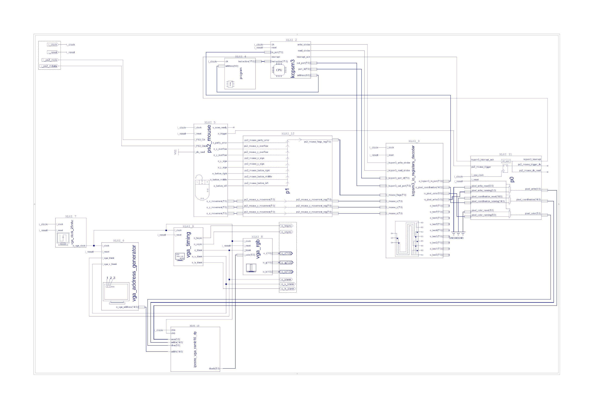

# kcpsm3_vga
## This simple project show example where PicoBlaze CPU and him assembler can be harnessed to draw some pixels in VGA (with PS/2 mouse).

### Other Examples
- Cordic Algorithm on 8bit PicoBlaze - https://github.com/kedziorno/kcpsm3_vga/tree/main
### Documentation

